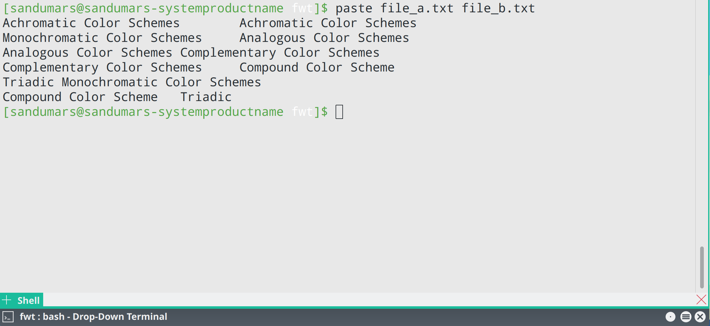
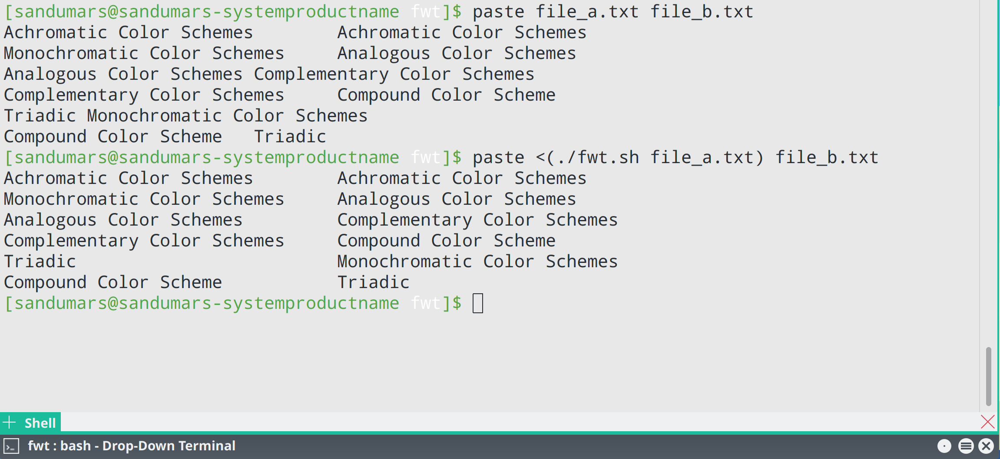

##Fixed Width Text
Uses this bash function you can set a fixed width for the text,
the length longest line in the text is considered as the width.
###Paste command in Linux with  **Fixed Width Text**
```

./fwt.sh file_a.txt | paste - file_b.txt

```
### or
```

paste <(./fwt.sh file_a.txt) <(./fwt.sh file_b.txt)

```

 

 

